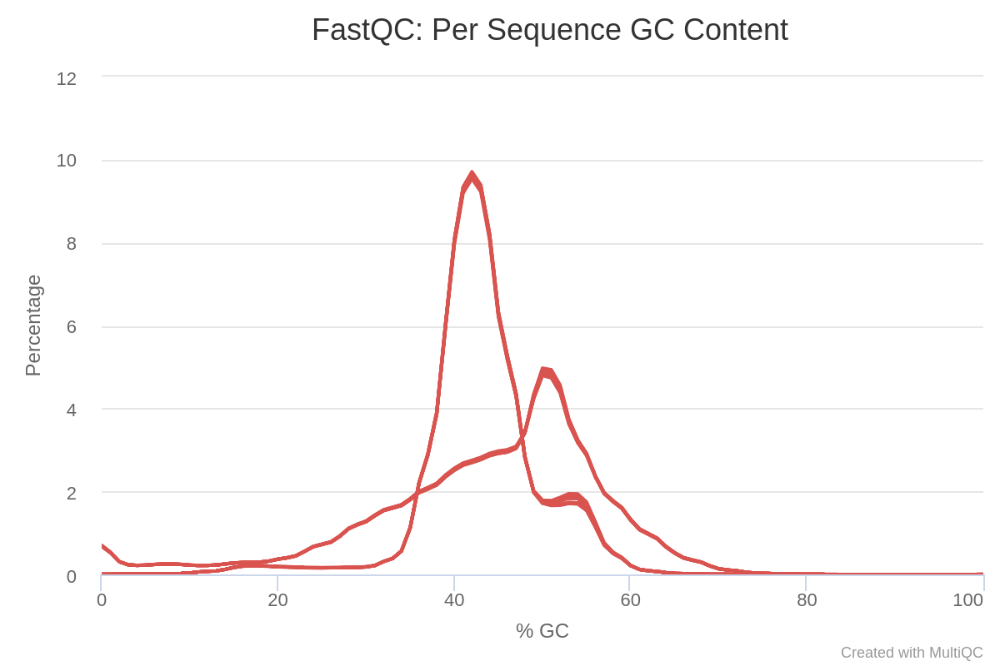
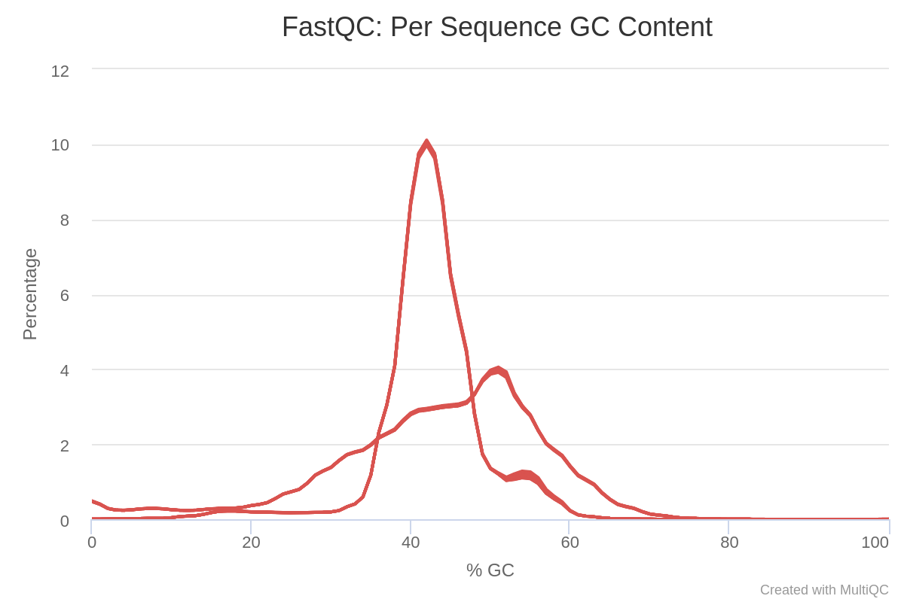
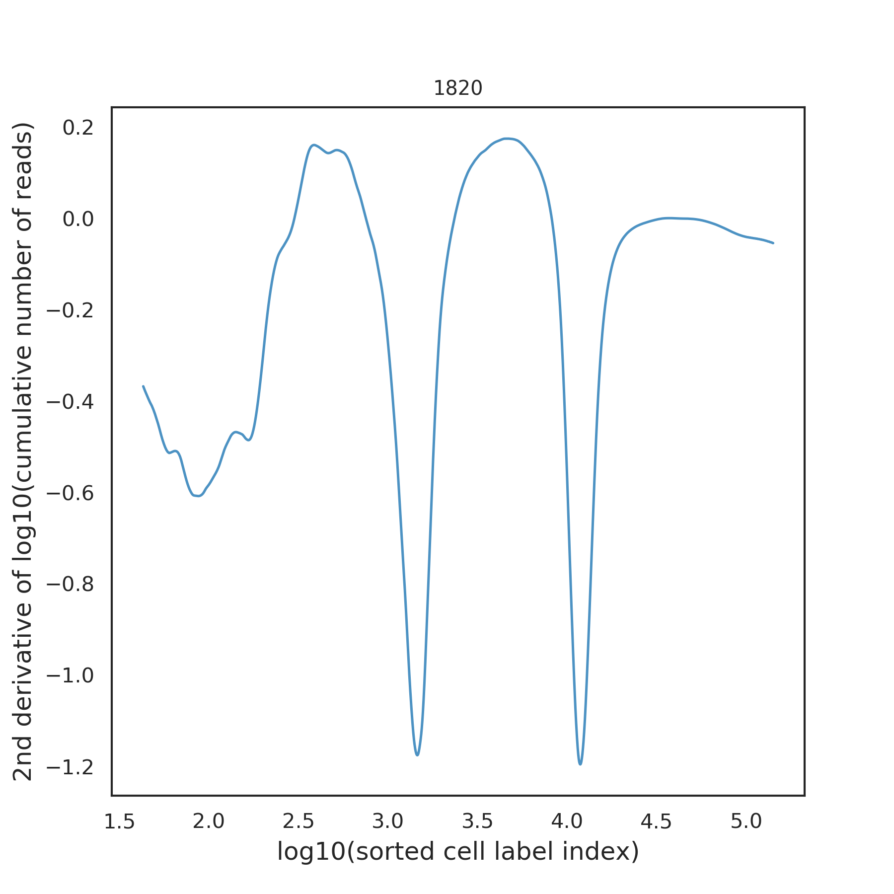
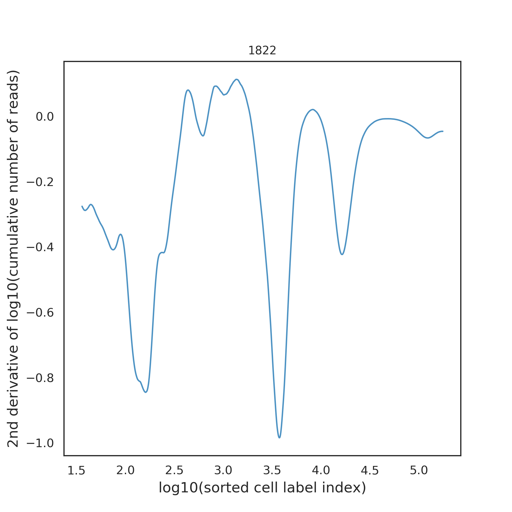
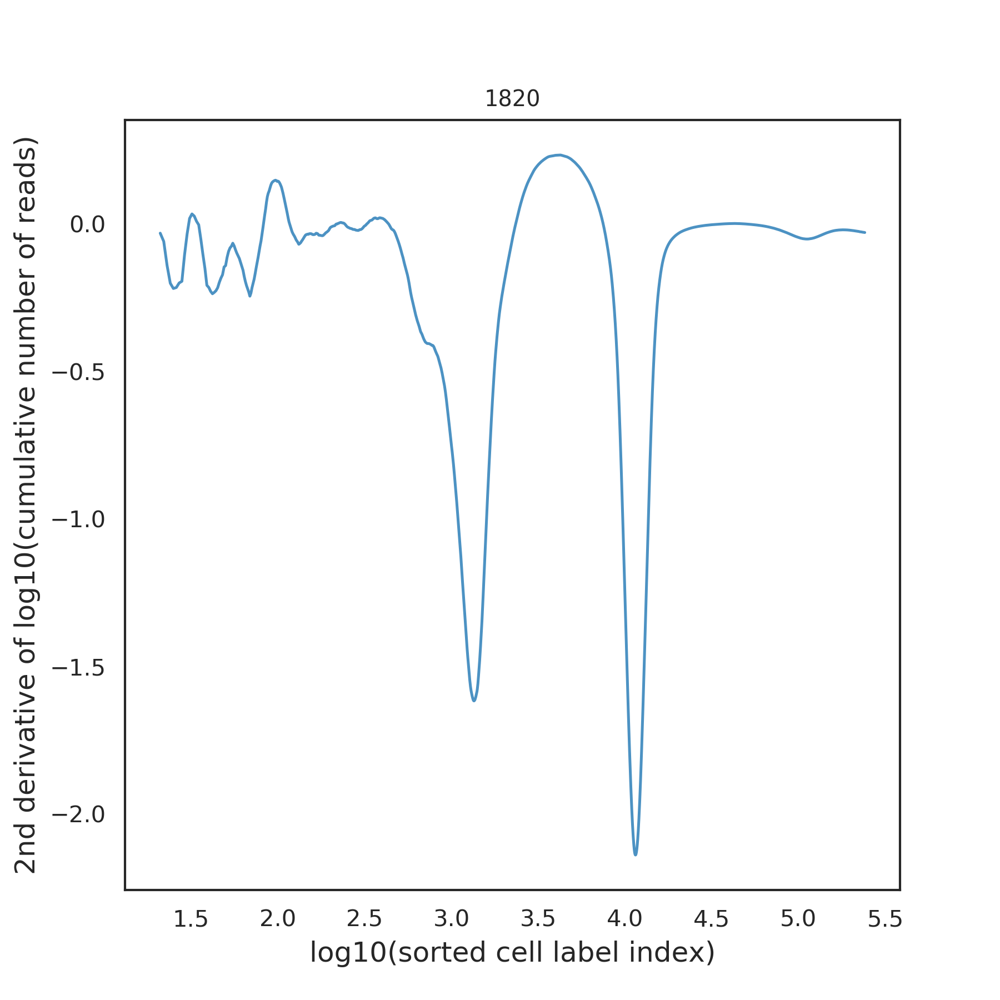
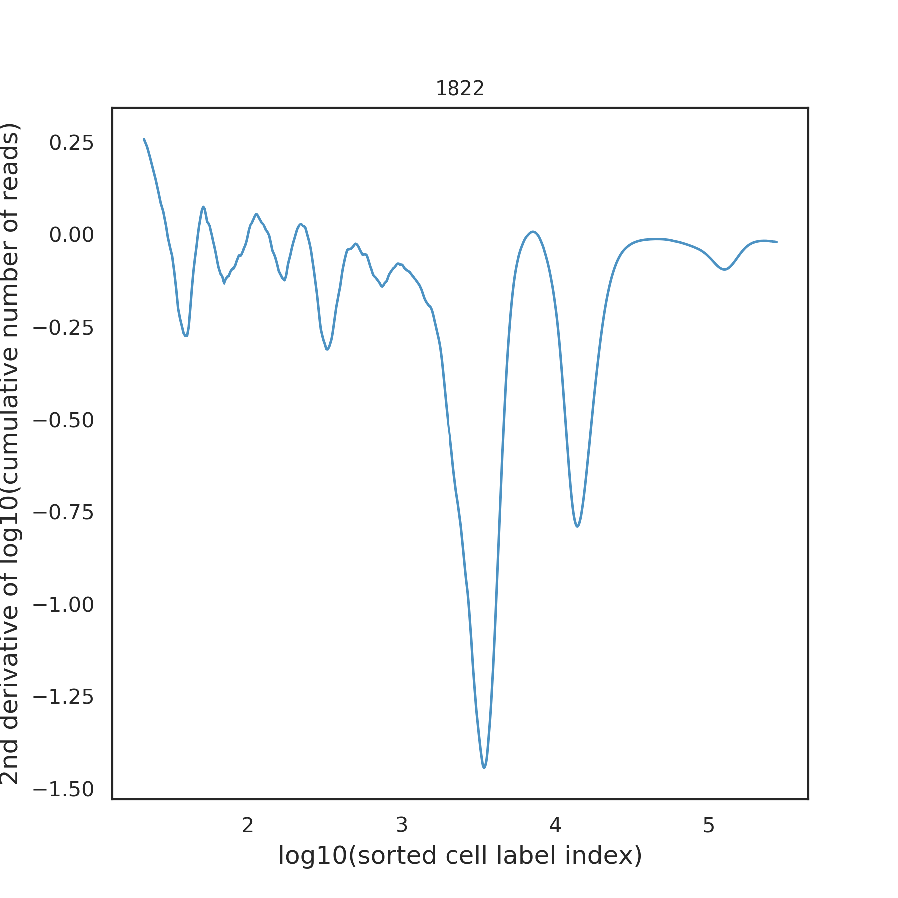

```{r setup, include=FALSE}
knitr::opts_chunk$set(echo = FALSE, cache = TRUE)
options(scipen = 999)
```

```{r load-libraries}
library(Matrix)
library(Matrix.utils)
library(tidyverse)
library(Seurat)
library(janitor)
library(ggsci)
library(ggpubr)
library(cowplot)
library(DT)
library(biomaRt)
source("helperFunctions.R")
```

- [x] Translate German text into English
- [x] Create Seurat Objects all samples with human annotation vs mouse annotation (4 Seurat objects)
- [x] Show overview table of annotation-structure (gene types and numbers) for BD Rhapsody vs CHR (here also mouse vs human) -> section "Annotation and Mapping"
- [x] Create figure of position-based GC content for both samples -> we would like to see whether the AT-content is enriched at the ends of the reads
- [ ] Create comparative table of the 4 annotations ->  wide format with columns for each sample and each annotation (Section Quality Filters)
- [ ] Prepare overview figure for molecular index statistics -> facet_grid (annotation ~ sample)
- [x] Prepare overview figure for Cell label filtering with similar structure of molecular index statistics
- [ ] Add legends to all figures and tables -> use chunk-options
- [ ] Read the paper from Aznaourova et al (https://doi.org/10.1101/2021.11.05.467458) and summarize relevant method points for the analysis of lncRNA using BD Rhapsody

```{r load-data, eval=FALSE}
load("data/unfilteredSeurat_full.Rdata")
lapply(list_seurat, function(x) dim(x) %>% enframe(name = "dim")) %>% 
  bind_rows(.id = "experiment") %>% 
  mutate(dim = ifelse(dim == 1, "nrGenes", "nrCells")) %>% 
  mutate(filter = "none") -> countCells

mypal <- pal_jama()(2)

```

# Data overview {#top}

1. HNSCC-PDX (untreated, 1820): 
    - The probe was separated after dissociation. One part was marked with a sample tag, the other was unlabeled. Both probes were loaded on the cartridge and translated into cDNA. The libraries were prepared for the sample tag as well as the target cDNA. They both have the same index.
    - This approach was used to test the specifity of the sample tags.

1. HNSCC-PDX (treated with alpelisib, 1822): 
    - Right after dissociation the probe was loaded on the cartridge. This probe has no sample tag and has a different index. 

# Material and Methods

All probes have a spike-in with PhiX before the sequencing at the BIH Core Facility Genomics.

## Sequencing

Cells were sequenced with the BD Rhapsody System. This is a cartridge-based system, where single cells are loaded and lysed. During lysis RNA is coupled to beads and is subsequently reverse-transcribed into cDNA. The system allows to multiplex different samples, where each sample is marked with a specific sample tag. With this system it is also possible to analyse protein expression on a single cell level using antibody based sequencing.

## Alignment and Demultiplexing

- bbsplit  (using mouse and human) 
  - so far no successful run possible
- demultiplexing and alignment to human reference genome GrCH38 was done using 7bridges

-> back to [top][Data overview]

# Question and Tasks

The major question in this project is how does Alpelisib-treatment change signaling in HNSCC. 

Before we can do a signaling analysis, we have to solve a couple of technical tasks, which are detailed below:

1. Why do we lose a lot of Reads ? 
    - trimming of R1 is not necessary and possibly some reads can be preserved this way
    - the parameters of the STAR- Aligner can still be optimized
2. GC content is lower than expected (42%) - why?
    - spike-in with PhiX -> however PhiX has a GC content of 47%, this is probably not the reason
    - contamination with PhiX is about 2% and should not be a problem for alignment
    - due to the necrotic material mtRNA could be enriched -> but also here the GC content is theoretically ~48% and is probably not crucial
    - it could be a cell type specific effect -> are certain RNAs overexpressed in HNC tumors?
    - Minor point: GC content is position dependent with a change at position 8-9 -> what is the reason for this?
    - Structure of libraries is polyA -> is this really edited out -> if not, there should be enrichment at the end
 
This plot shows the GC Content per sequence in the 1820 sample.

This plot shows the GC Content per sequence in the 1822 sample.
3. How many % of the samples are mouse specific?
    - to my knowledge PDX models can contain up to 70-80\% mouse stromal cells - Are there any estimates for this for your models? RNA sequencing of xenograft-derived organoids from peritoneal carcinomatosis (Mathias ->EFRE project) found up to 80% mouse content in the sample. Mathias hypothesized based on the data that the proportion of stromal cells from mouse increases per passage.  
    - comparison of tagged sequences with different alignment approaches.
    - the current parameters for the alignment are unproblematic so far
    - independent alignment on mouse or human suggests, using the annotation file provided by 7bridges:
        - sample 1820 has 18% human vs 61% mouse
        - sample 1822 has 20% human vs 64% mouse
    - independent alignment on human suggests, using the long non-coding annotation file:
        - sample 1820 has 37% human 
        - sample 1822 has 40% human 
    - independent alignment on mouse or human suggests, using the comprehensive annotation file:
        - sample 1820 has 41% human vs 70% mouse
        - sample 1822 has 42% human vs 71% mouse
4. How many cells must be used for sequencing at the beginning?
    - depending on:
        - how many doublets / unmapped cells fall out?
        - how many dying / dead cells fall out?
        - how many cells are mouse-specific?
        - are there clusters or subtypes of cells in the untreated sample that need to be considered?
        
-> back to [top][Data overview]

# Analysis of pipeline results from 7bridges
## Experimental design

Changing the number of cells rather than the sequencing depth might be an option. See https://www.nature.com/articles/s41467-020-14482-y

Changing cell number needs to be done before library preparation.

## Annotation and Mapping
To create the index files for the mapping step with the STAR-Aligner we used three different annotation files per sample and genome (Human & Mouse).
The first annotation file was provided by 7bridges.
PRI - It contains the comprehensive gene annotation on the primary assembly (chromosomes and scaffolds) sequence regions
    - This is a superset of the main annotation file
The next annotation file was used because we are thinking that long non-coding RNA is playing an important role in HNSCC.
NLC - It contains the comprehensive gene annotation of lncRNA genes on the reference chromosomes
    - This is a subset of the main annotation file
The third annotation file was used because we did-not found any mtRNA in the long non-coding RNA annotation file. Thats why we used the comprehensive gene annotation file which contains gene types from both other annotations.
CHR - It contains the comprehensive gene annotation on the reference chromosomes only
    - This is the main annotation file for most users
The tables below show the three annotations files for human and mouse. It contains the different gene types and their number in each of the files. 
```{r gtf_tables, max.print: 1}
table_human <- read_csv("data/Gtf_Annotation/gtf_table.csv")
table_mouse <- read_csv("data/Gtf_Annotation/gtf_table_mouse.csv")
dt_human <- datatable(table_human, extensions = "Scroller", width = 1000, options= list(scrolly = 200, scroller = T, scrollX = 200, pageLength = 1))
dt_mouse <- datatable(table_mouse, extensions = "Scroller", width = 1000, options= list(scrolly = 200, scroller = T, scrollX = 200, pageLength = 1))
dt_human
```

## Quality Filters
```{r bdQuality, layout="l-page"}
fname <- "data/1820_Metrics_Summary.csv"
readMetricsSummary(fname) %>% 
  mutate(genome = "human") %>% 
  bind_rows(readMetricsSummary("data/mouse_run/_1_1820_Metrics_Summary.csv") %>% mutate(genome = "mouse")) %>% 
  filter(!is.na(value)) -> metrics

metrics %>% 
  datatable()
```

## Molecular index statistics

PCR and sequencing errors within UMI sequence generate artifact molecules and contribute to over estimation of molecules. Molecular Index (MI) adjustment identify these artifacts and discard or re-assign them to their original index (from BD slides).

```{r umiStatistics}
read_csv("data/1820_UMI_Adjusted_Stats.csv", comment = "##") %>% 
  mutate(genome = "human") %>% 
  bind_rows(
    read_csv("data/mouse_run/_1_1820_UMI_Adjusted_Stats.csv", comment = "##") %>% 
      mutate(genome = "mouse")) -> umi.stats

umi.stats %>% 
  group_by(genome) %>% 
  summarize(meanRSEC = mean(RSEC_Adjusted_Seq_Depth_without_Singletons))

umi.stats %>% 
  gghistogram(x = "RSEC_Adjusted_Seq_Depth_without_Singletons", fill = "Status", facet.by = "genome") + 
  scale_x_log10() + 
  geom_vline(xintercept = 6, color = "darkred", lty = "dashed", size = 1)
```

In general, this is a two-step process, including RSEC-adjustment and DBEC-adjustment

1. Recursive Substitution Error Correction (RSEC)

- Corrects for MI errors that are derived from sequencing base calls and PCR substitution errors
- Based on edit distance of molecular indices
- Similar method used by most other competitors/academic pipelines

2. Distribution Based Error Correction (DBEC)

- Adjusts for errors derived from library preparation steps or sequencing base deletions.
- Based on distribution of sequencing coverage of molecular indices
- Developed at BD Genomics

Due to the low sequencing depth in our example (see threshold in Figure), DBEC-adjustment was not applied.

## Cell label filtering

The number of unique cell labels should be similar to the number of cells captured and amplified by the BD Rhapsody workflow. Causes of excess cell labels (from BD slides) :

- Spill over of mRNA to the neighboring wells
- Underloading beads in Rhapsody Cartridges: cells without beads and the RNA from the cells diffusing to adjacent wells
- Experiencing low level contamination during oligonucleotide and bead synthesis
- Generating errors during the PCR amplification steps of the workflow

In our case, the analysis of cell labels indicates two cell populations with very different expression levels:
The following next plots show the samples which were aligned to the human genome.




The next two plots show the samples which were aligned to the mouse genome.


